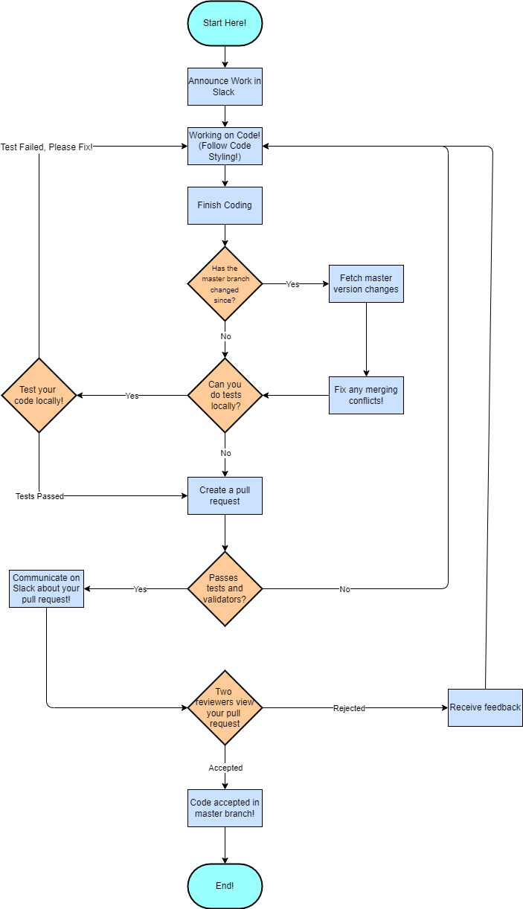

# Continuous Integration and Deployment Guide

Last Updated: 10 May 2025  

The goal of the pipeline is to filter code not up to par to quality but to also make sure that it is not very difficult to make a change to the master branch.

## Step 1 - Communication on Slack
- **Announce Work in Slack**  
    Before starting any task:
    - Please communicate on what you're working on.
  - Reference related GitHub Issues (`Closes #3`, `Progress on #4`)
  - For example:
    `"I'll try to progress on the UI redesign.  This relates to issues #5 and #6"`  

The purpose of this step is to keep the team informed and avoid any unnecessary duplicate work and merging issues!

## Step 2 - Creating Quality Code!  

- **While working on code, please follow these guidelines:**  
    - Good indentation and formatting.
    - A comment on each function describing what it does.
    - Consistent name conventions.
    - Clear naming variables and functions.
    - Extra comments on any complex lines of code to help others understand.
    - Brackets should have their own line for easier reading.

For now, we want to keep it simple, but later on we may more strict coding guidelines and have programs or pipeline tests to check if needed. **We will depend on pull request reviewers currently** to check if the code writing is readable and easy to understand.

### Example of Code Styling
Since good indentation and formatting is difficult to describe, here is some examples of code following our guidelines.

``` JavaScript
// this function constant, add, provides a sum out of two numbers
const add = (number1, number2) => 
{
    const result = number1 + number2  // this line adds number1 and number2 to make the sum
    return result
}
```

Here is another example:
``` JavaScript
setInterval(timer, 1000); // runs the timer function every 1000ms. (1 second)

// this function, timer,  provides the current time every second.
function timer() 
{
    let dates = new Date();
    let time = dates.toLocaleTimeString(); 
    console.log(time);
} // Please note the brackets!  
```

## Step 3 - Done Writing Code? Merging Conflicts...  

Since we are a 11 person team, **we are bound to work on the same project together at the same time and eventually face merging conflicts.**

### Please follow these steps when you are done writing your own code and ***before*** making a pull request!

- Fetch the latest master branch version changes.
- Manually resolve conflicts within your code and the master branch.
- Please note any changes to any previous code in your future pull request.
- Test resolved code if it passes the tests.

This will help lower the amount of merging conflicts we will have to deal with for pull requests!

## Step 4 - Done Writing Code and Fixing Merging Conflicts? Pull Request Time!  

After writing your code and fixing merging conflicts, please test your code with our unit tests locally if you can! We plan on having unit tests in our project. 

### Pull Request Description
- On the pull request, please describe what it is contributing! For example: `I made some progress on issue #28, which is about phase1.md. I made some progress on the markdown file, such as formatting and writing all the lines here in this markdown file."`

### Once you made a pull request:

#### Github Actions - Unit Tests and Validators
We plan on implementing unit tests, HTML validator, and a CSS validator to automatically work when your pull request is created. Please look if your code fulfills and passes the tests and the validator!

#### When your code passes all the tests:

- Please communicate on Slack about your pull request! For example: `"Hello- I made a pull request #12, which is about implementing the contract onto the repo!" Please take a look at it!`
- Please note any changes you had to previous code due to merging conflicts in your message as well!
- The pull request needs **2 separate reviewers** to look at your pull request! 
- For reviewers, please give feedback if there is anything to comment on. 
- We want everyone to review pull requests, *if needed, we could implement a system* to make ssure no one is reviewing more or less than they should be.  
- *Reviewers:* For pull requests that are denied, please give clarification on your feedback if the pull requester asks for it!  

## Step 5 - Code Implemented
After following and meeting all these guidelines and requirements, your code is then finally in the master branch! Well done! 

## Continuous Updates and Future Implementations 
We may plan on adding on additional systems or expanding our current systems if needed. Some additions/improvements may be:
- More Unit Tests (These will have to be continuous.)
- Automated Documentation Generation
- Automated Code Style Enforcement
- Code Coverage Reports
- Pull Request Reviewer System


## Summary 
- Please communicate on Slack on what part of the project you are working on.  
- Follow the code style guidelines.  
- Check if there was any commits to the master branch to add to your branch ***before*** making a pull request to avoid dealing with any unnecessary merging conflicts. 
- Write descriptive pull requests and communicate on Slack about your pull request if your code passes all the tests and validators.  

## Pipeline Diagram
Here is a diagram showcasing the steps needed to make a change on the master branch!  



