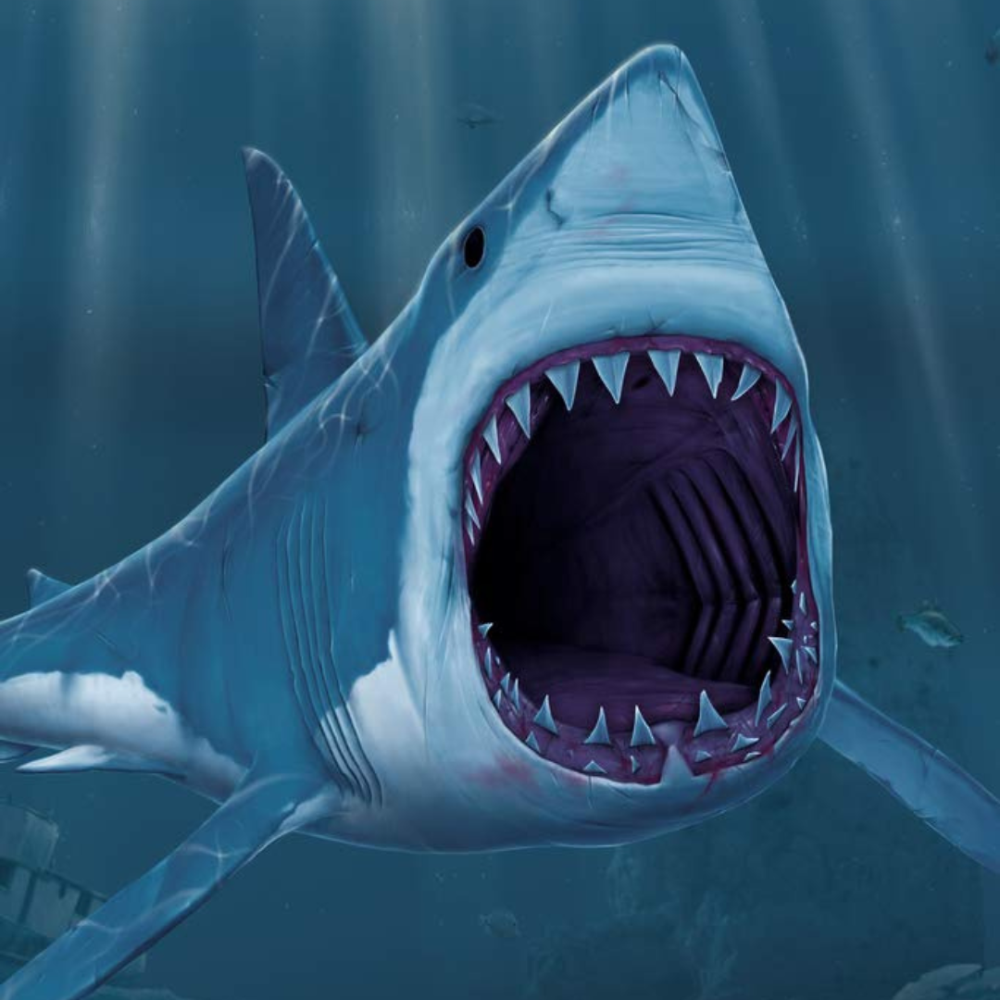
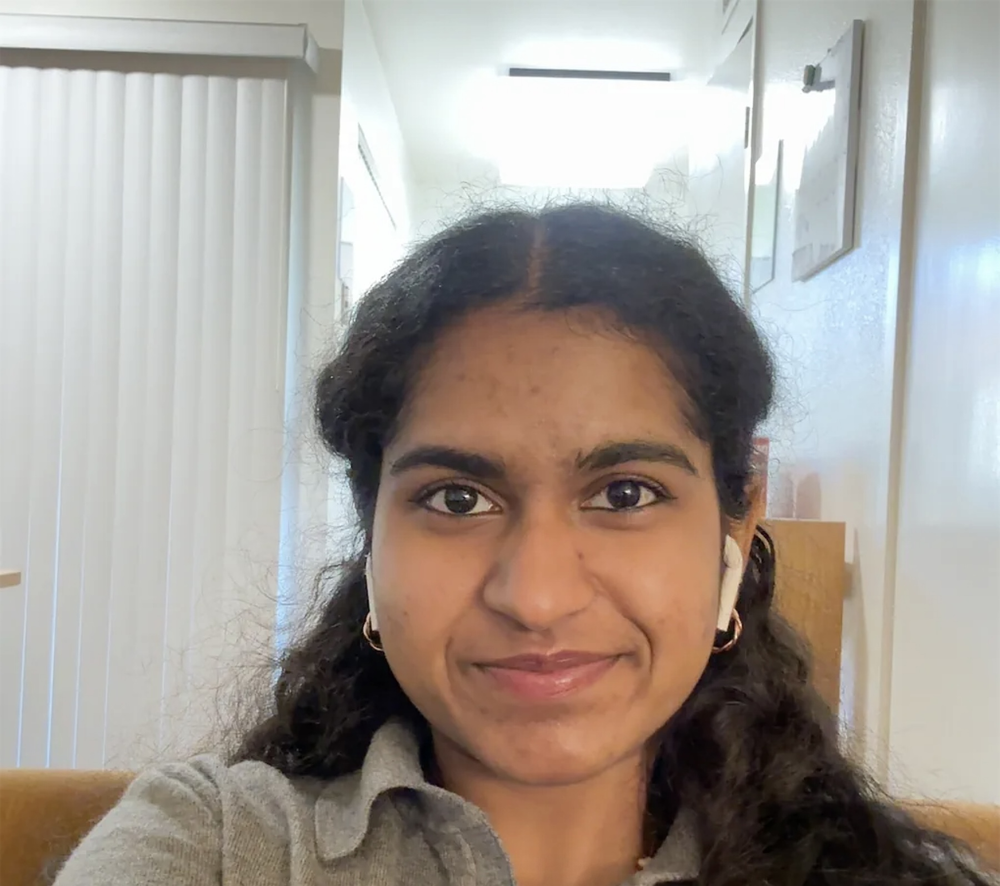

# Group 5: Code-Blooded 🩸

---

# 👥 Our Team Members

## Jonathan Ty

Hello! My name is Jonathan Ty, I'm a second-year Computer Science major with a minor in Cognitive Science! I've had experience in frontend development and UI/UX design, but I'm open to anything when it comes to backend (JavaScript, SQL, etc.). In my free time, I enjoy going on runs 🏃‍♂️, listening to music 🎶, and board games 🎲.

## Teá Ruiz

Hi! My name is Teá Ruiz, I am a fourth-year Math-Computer Science major. My programming experience mostly lies in C++ and Java. Some of my hobbies include crocheting, reading and baking. 

## Ibrahim Yurdan

Hello! I'm Ibrahim Yurdan, a 4th year Computer Science major passionate about cloud computing and AWS.
I'm currently exploring cloud projects, backend systems, and anything that helps me grow as an engineer.
I enjoy playing the piano, hitting the tennis court, and exploring new places.

## Abhyuday Singh

Hello! I'm Abhyuday Singh, a 2nd year Math-CS major. I'm a huge sports fan and a Chelsea FC supporter. I enjoy playing chess, listening to music and playing soccer.

## Emily Nguyen

Computer science major with a minor in design. Happy to be here :D

## Aaron Joshua Delacruz

Hello! I'm Aaron Joshua Delacruz, a Computer Science major. Right now, I'm still pretty new to CS, and still exploring which field I would want to focus on. During free time, I enjoy playing games and recently, watching shows/animations.

## Renee Dhanaraj

Hi! I'm a computer science student passionate about building smart, efficient, and user-friendly tech. I have a strong interest in cloud computing and engineering, and I enjoy working on projects that blend creativity with problem-solving. Outside of tech, I love playing the piano, hitting the tennis courts, and keeping up with Formula 1. I'm always eager to learn something new and expand my skills.

## Omar Akbari

Hey :wave:, my name is Omar Akbari. I'm a fourth year Computer Science major with an interest in software development, especially backend systems. I'm most comfortable with C-family programming languages (C, C++, Java), though I've dabbled in at least a dozen others. My favorite areas of study are operating systems, computer architecture, and memory management. Outside of CS, my main hobby and passion is gaming. I've been playing games for as long as I can remember, and video games are actually what got me into software development in the first place. My favorite series is Metal Gear Solid.

> "A strong man doesn't need to read the future. He makes his own." – Solid Snake
> (from Metal Gear Solid)

## Aman Dhillon

Hi, My name is Aman Dhillon! I am a second-year Computer Science major. I am primarly interest in software development. I am familiar with Java, C, C++, python, and HTML/CSS. Outside of CS I love going to the gym and beach!

## Ruyi Wu

Hello! I'm Ruyi Wu, a Math-CS major student. I realy like to write code to solve my math problems. I enjoy to play video games when I am free.

## Somtochukwu Ikeanyi

4th year Bioengineering Bioinformatics student passionate about quality control!

