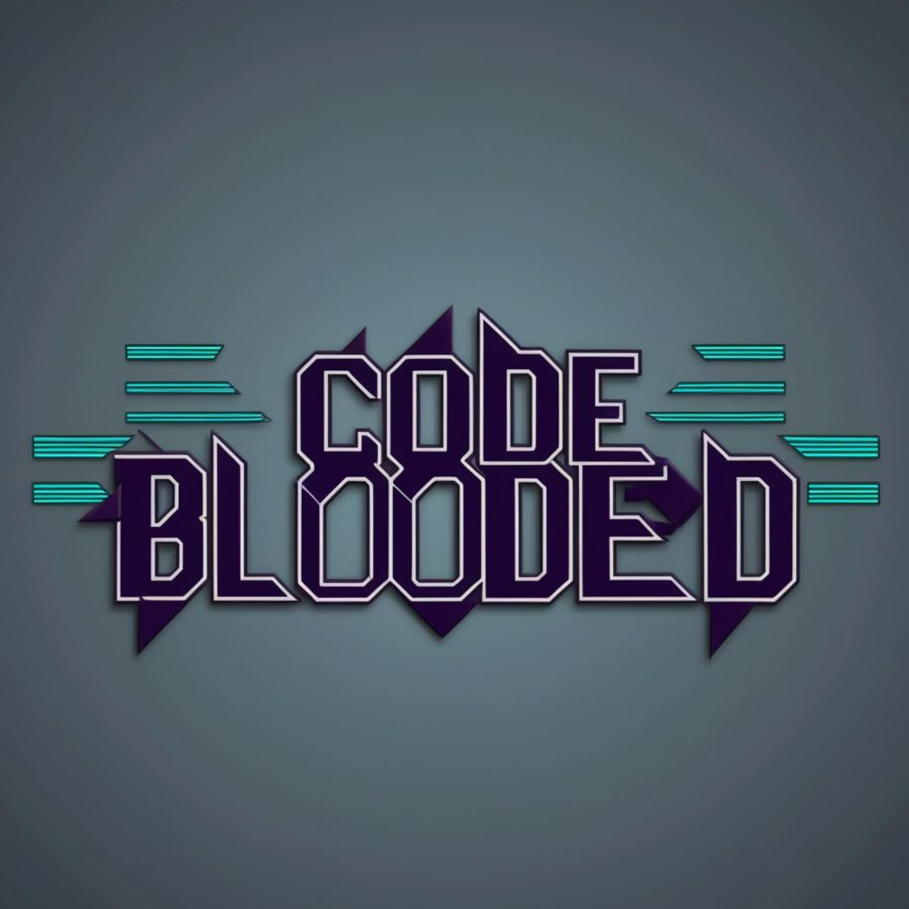

# Group 5: Code-Blooded
## Logo

## Mascot

## Team Roster
### Jonathan Ty

Hello! My name is Jonathan Ty, I'm a second-year Computer Science major with a minor in Cognitive Science! I've had experience in frontend development and UI/UX design, but I'm open to anything when it comes to backend (JavaScript, SQL, etc.). In my free time, I enjoy going on runs 🏃‍♂️, listening to music 🎶, and board games 🎲.

[👉 Link to GitHub 👈](https://github.com/jonathan-ty)

### Teá Ruiz

Hi! My name is Teá Ruiz, I am a fourth-year Math-Computer Science major. My programming experience mostly lies in C++ and Java. Some of my hobbies include crocheting, reading and baking. 

[Link to GitHub](https://tearuiz.github.io/Page/)

### Ibrahim Yurdan

Hello! I’m Ibrahim Yurdan, a 4th year Computer Science major passionate about cloud computing and AWS.
 I’m currently exploring cloud projects, backend systems, and anything that helps me grow as an engineer.
I enjoy playing the piano, hitting the tennis court, and exploring new places.

[Link to GitHub](https://github.com/ibrahimyurdan)

### Abhyuday Singh

Hello! I'm Abhyuday Singh, a 2nd year Math-CS major. I'm a huge sports fan and a Chelsea FC supporter. I enjoy playing chess, listening to music and playing soccer.

[Link to GitHub](https://github.com/Abhyuday180)

### Emily Nguyen

### Ruyi Wu

### Somtochukwu Ikeanyi

### Aaron Joshua Delacruz

### Renee Dhanaraj

### Omar Akbari

### Aman Dhillon

