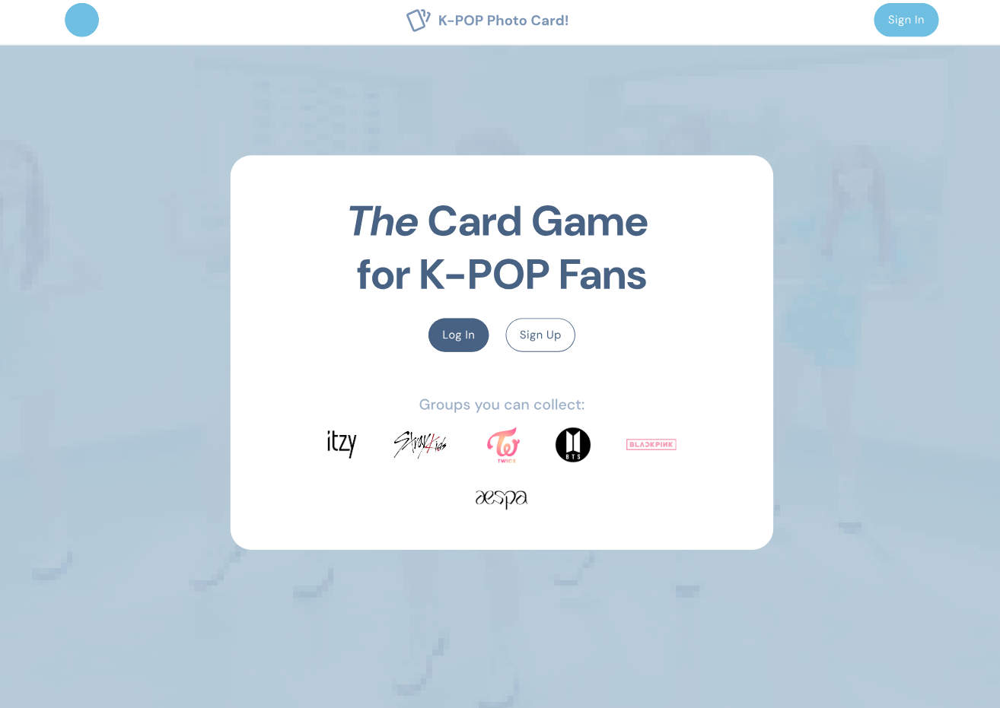
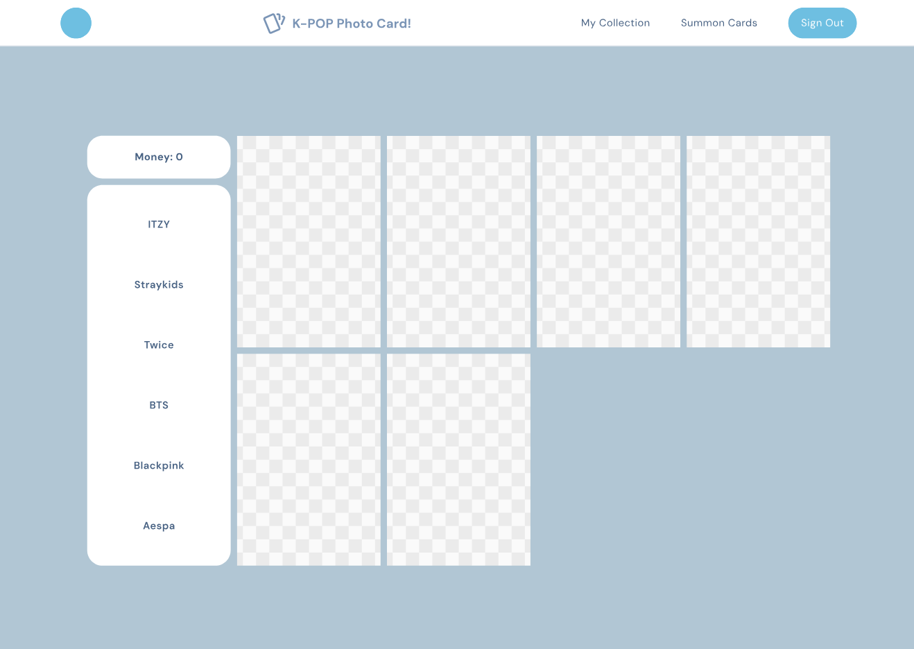

# Sprint Review (5/25)

May 25th, 8:20pm

Attendees: Aaron, Ibrahim, Omar, Jonathan, Tea

| Team Member | What you did | What you plan to do | Blockers |
| :---- | :---- | :---- | :---- |
| Ibrahim | Transferred demo to main repo | Work on Issue \#37 | N/A |
| Jonathan | Created mockup for new, more KPOP friendly design | Collect photocards for KPOP groups | Busy week, constraints from other commitments |
| Omar | Hosted meetings | Work on Issue \#37 | Busy weekend |
| Aaron | Created some tests and added them to CI/CD pipeline | Add more unit tests, work on card decoration feature | Demo isn’t on repo yet... hard to make new unit tests |
| Tea | Found pictures for KPOP groups | ADR update | Busy with brother’s graduation and midterms |

## Review

**New design mockup:**  
[https://www.figma.com/design/yIahLzVgf9APQi3oqnmmjO/CSE-110?node-id=0-1\&t=ueGsiCWYiXcnAR7R-1](https://www.figma.com/design/yIahLzVgf9APQi3oqnmmjO/CSE-110?node-id=0-1&t=ueGsiCWYiXcnAR7R-1)  

**Current Demo:** [https://cse110-sp25-group05.github.io/cse110-sp25-group05/source/kpopdemo/](https://cse110-sp25-group05.github.io/cse110-sp25-group05/source/kpopdemo/)
