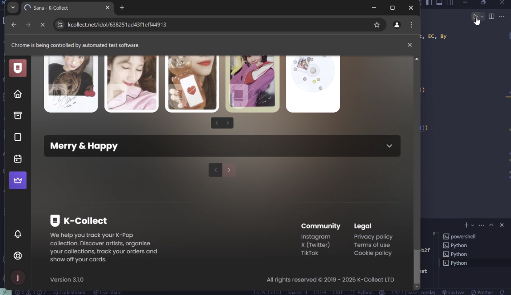
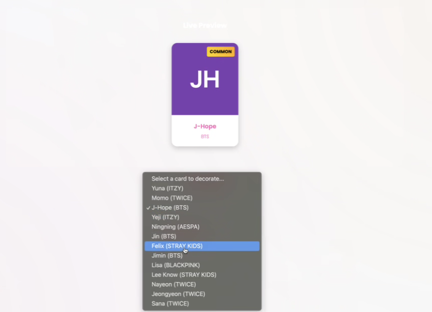
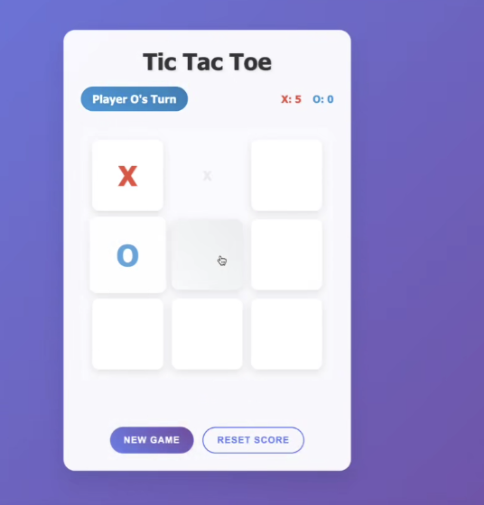

# Sprint Review 3

Date: June 1st, 9pm
Attendees: Emily, Abhyuday, Aaron, Omar, Jonathan, Ruyi, Ibrahim

---

Omar & Aaron:

- Worked on issue 37, has an outline for the page and now has to implement the core functionality. Wondering how they should style this new page.

Emily, Renee, Jonathan, Aman:

- Finished getting photos for all the groups
- Jonathan made a webcraper!
    
    
    
- We have to follow good style guidelines!! Very good point
- ADR for credit system

Abhyuday:

- Worked on Decoration homepage.

Ibrahim: 

- Finished tic-tac-toe minigame
- Thinking about pack mechanics → less cards pulled
- Change drop rates
    

